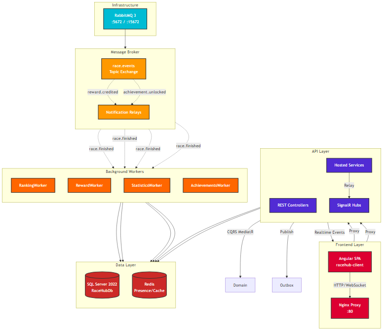
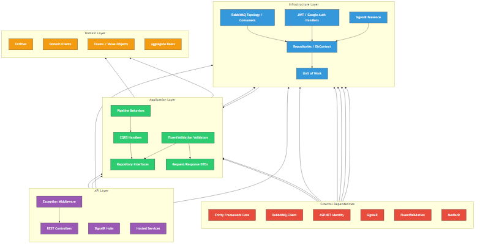
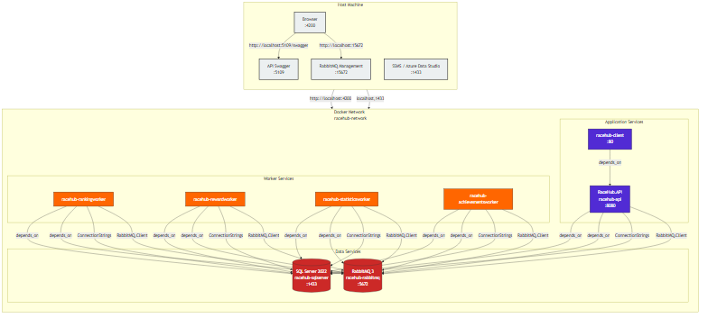
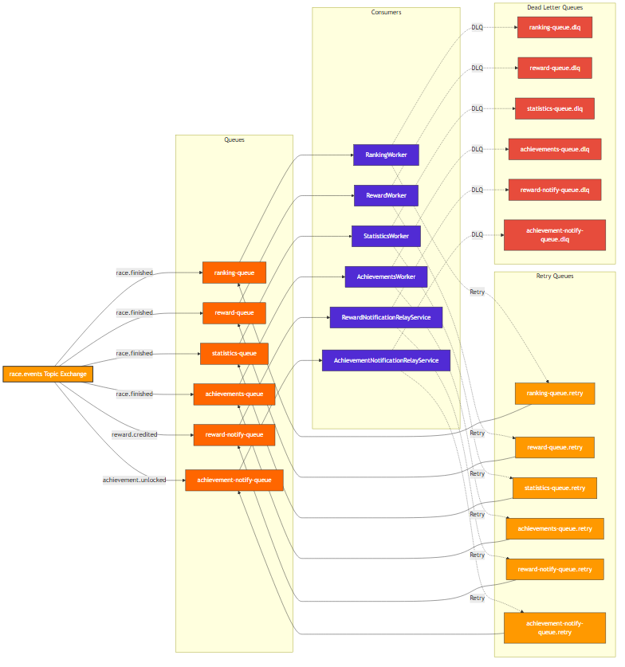
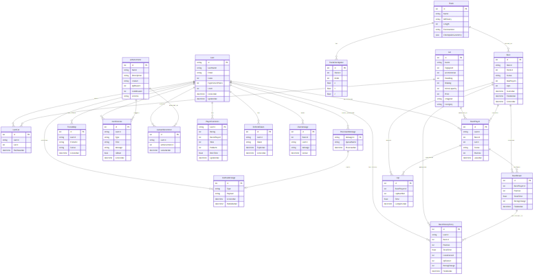

# 🏁 RaceHub

> Multiplayer racing game platform with message-queue-driven microservices

RaceHub is a real-time multiplayer racing game where players create race rooms, join lobbies, select cars, race on procedurally-generated tracks, and earn rewards (coins, XP, achievements). The project demonstrates RabbitMQ topic exchanges to decouple race result processing into independent background workers.


---

## 📑 Table of Contents

- [System Architecture](#-system-architecture)
- [Tech Stack](#-tech-stack)
- [Message Queue Flow](#-message-queue-flow)
- [Project Structure](#-project-structure)
- [Getting Started](#-getting-started)
- [Configuration](#-configuration)
- [API Reference](#-api-reference)
- [Frontend Guide](#-frontend-guide)
- [Database Schema](#-database-schema)
- [Deployment](#-deployment)

---

## 🏗️ System Architecture

### High-Level Architecture



### Clean Architecture Layers



### Deployment Topology



---

## 💡 Core Concepts

### Message Queue-Driven Architecture

RaceHub uses **RabbitMQ Topic Exchange** to decouple race result processing. When a race finishes:

1. The API publishes a `RaceFinishedIntegrationEvent` to the `race.events` topic exchange
2. Four independent worker queues receive the event via topic bindings
3. Workers process side effects **asynchronously** without blocking the HTTP response
4. The `RewardWorker` and `AchievementsWorker` publish follow-up events
5. API-hosted relay services push live SignalR notifications to connected clients

This pattern enables:
- **Scalability**: Add new consumers without modifying existing code
- **Resilience**: Workers can be restarted independently; failed messages go to DLQ
- **Observability**: Each worker has dedicated queues, retry policies, and dead-letter queues

### Idempotency & Retry

All workers inherit from `IdempotentConsumer`, providing:

| Feature | Implementation |
|---------|---------------|
| **Idempotency** | `ProcessedMessage` table tracks consumed message IDs |
| **Retry** | Exponential backoff: 1s → 2s → 4s → 8s → 16s (5 attempts) |
| **DLQ** | Failed messages move to `*.dlq` queues after retry exhaustion |
| **Topology** | Each queue has `.retry` and `.dlq` variants |

### CQRS Pattern

The application layer uses **MediatR** for Command Query Responsibility Segregation:

- **Commands**: `CreateRace`, `JoinRace`, `FinishRace`, `RecordLap`
- **Queries**: `GetLeaderboard`, `GetUserProfile`, `GetRaceHistory`
- **Pipeline Behaviors**: Validation (FluentValidation), logging, transaction wrapping

### Real-Time Communication

- **SignalR Hubs**: `RaceHub` (race events), `ChatHub` (lobby chat)
- **Presence Tracking**: In-memory presence tracker
- **Live Notifications**: SignalR toasts for rewards and achievements

---

## 🛠️ Tech Stack

### Backend

| Component | Technology |
|-----------|-----------|
| Language | C# 13 / .NET 10 |
| Web Framework | ASP.NET Core 10 |
| API Style | REST + MediatR (CQRS) |
| Realtime | SignalR |
| ORM | Entity Framework Core 10 |
| Database | SQL Server 2022 Express |
| Messaging | RabbitMQ 3 (Topic Exchange) |
| Auth | JWT Bearer + ASP.NET Identity + Google Sign-In |
| Validation | FluentValidation |
| Containerization | Docker + Docker Compose |

### Frontend

| Component | Technology |
|-----------|-----------|
| Framework | Angular 18.2 |
| Language | TypeScript 5.4 |
| State | RxJS 7.8 |
| Realtime Client | @microsoft/signalr 8.0 |
| Build | Angular CLI |
| Proxy | Nginx (production) |

---

## 📂 Project Structure

```
RaceHub/
├── .env                          # Environment variables (git-ignored)
├── .env.example                  # Environment template
├── docker-compose.yml            # Multi-container orchestration
├── docs/
│   ├── architecture/             # Architecture diagrams
│   ├── database/                 # Database ERD and schema diagrams
│   ├── images/                   # Screenshots
│   └── messaging/                # RabbitMQ topology and flow diagrams
├── backend/
│   └── src/
│       ├── RaceHub.API/               # ASP.NET Core Web API + SignalR
│       │   ├── Controllers/           # REST endpoints
│       │   ├── Hubs/                  # SignalR hubs
│       │   ├── Messaging/             # Notification relay services
│       │   ├── Middleware/            # Exception handling
│       │   └── Program.cs             # App bootstrap, seeding
│       ├── RaceHub.Application/       # CQRS handlers, validators, DTOs
│       │   └── Features/              # Modular feature folders
│       ├── RaceHub.Contracts/         # Integration events, topology
│       ├── RaceHub.Domain/            # Entities, enums, domain events
│       ├── RaceHub.Infrastructure/    # EF Core, RabbitMQ, Identity, SignalR
│       ├── RaceHub.RankingWorker/     # Ranking update consumer
│       ├── RaceHub.RewardWorker/      # Reward distribution consumer
│       ├── RaceHub.StatisticsWorker/  # Race history consumer
│       └── RaceHub.AchievementsWorker/# Achievement evaluation consumer
└── frontend/
    └── racehub-client/
        ├── src/
        │   ├── app/
        │   │   ├── core/           # Services, guards, interceptors
        │   │   ├── layout/         # Shared layout components
        │   │   ├── pages/          # Feature pages
        │   │   └── shared/         # Reusable components
        │   ├── assets/
        │   └── environments/
        ├── Dockerfile
        └── nginx.conf
```

---

## 📚 Documentation

All architecture, database, and messaging diagrams are available as PNG images in the `docs/` folder.

See [`docs/images/`](docs/images/) for application screenshots.

## 📸 Screenshots


---

## 🚀 Getting Started

### Prerequisites

- [Docker Desktop](https://www.docker.com/products/docker-desktop/) (with Compose plugin)
- [.NET 10 SDK](https://dotnet.microsoft.com/download/dotnet/10.0) (for local development)
- [Node.js 18+](https://nodejs.org/) (for frontend development)
- [Angular CLI](https://angular.dev/tools/cli) (optional, for frontend dev)

### Quick Start (Docker)

1. **Clone the repository**
   ```bash
   git clone https://github.com/yourusername/RaceHub.git
   cd RaceHub
   ```

2. **Configure environment variables**
   ```bash
   cp .env.example .env
   # Edit .env with your values (see Configuration section)
   ```

3. **Start all services**
   ```bash
   docker compose up --build
   ```

4. **Access the application**
   - Frontend: http://localhost:4200
   - API: http://localhost:5109/swagger
   - RabbitMQ Management: http://localhost:15672 (user: `racehub`, pass: `racehub123`)
   - SQL Server: `localhost:1433` (sa / your password)

### Local Development (Backend)

```bash
# Start infrastructure
docker compose up sqlserver rabbitmq -d

# Run API
cd backend
dotnet run --project src/RaceHub.API/RaceHub.API.csproj

# Run workers (in separate terminals)
dotnet run --project src/RaceHub.RankingWorker/RaceHub.RankingWorker.csproj
dotnet run --project src/RaceHub.RewardWorker/RaceHub.RewardWorker.csproj
dotnet run --project src/RaceHub.StatisticsWorker/RaceHub.StatisticsWorker.csproj
dotnet run --project src/RaceHub.AchievementsWorker/RaceHub.AchievementsWorker.csproj
```

### Local Development (Frontend)

```bash
cd frontend/racehub-client
npm install
ng serve
# Navigate to http://localhost:4200
```

---

## ⚙️ Configuration

### Environment Variables

| Variable | Description | Default |
|----------|-------------|---------|
| `SQL_SA_PASSWORD` | SQL Server SA password (must meet strong policy) | `Ch@ngeMe123!` |
| `JWT_SECRET_KEY` | JWT signing key (use long random value in production) | — |
| `JWT_ISSUER` | JWT issuer claim | `RaceHub` |
| `JWT_AUDIENCE` | JWT audience claim | `RaceHubClient` |
| `JWT_ACCESS_TOKEN_MINUTES` | Access token expiration | `15` |
| `JWT_REFRESH_TOKEN_DAYS` | Refresh token expiration | `7` |
| `GOOGLE_CLIENT_ID` | Google OAuth client ID | — |
| `GOOGLE_CLIENT_SECRET` | Google OAuth client secret | — |
| `FRONTEND_ORIGIN` | CORS allowed origin | `http://localhost:4200` |
| `RABBITMQ_USER` | RabbitMQ username | `racehub` |
| `RABBITMQ_PASSWORD` | RabbitMQ password | `racehub123` |
| `ASPNETCORE_ENVIRONMENT` | ASP.NET environment | `Production` |

### Database Connection String

```
Server=sqlserver;Database=RaceHubDb;User Id=sa;Password=${SQL_SA_PASSWORD};TrustServerCertificate=True;
```

### RabbitMQ Topology



---

## 📡 API Reference

### Authentication Endpoints

| Method | Endpoint | Description |
|--------|----------|-------------|
| `POST` | `/api/authentication/register` | Register new user |
| `POST` | `/api/authentication/login` | Login with credentials |
| `POST` | `/api/authentication/refresh-token` | Refresh access token |
| `POST` | `/api/authentication/google` | Google Sign-In |

### Race Endpoints

| Method | Endpoint | Description |
|--------|----------|-------------|
| `POST` | `/api/races` | Create a new race room |
| `POST` | `/api/races/{id}/join` | Join a race lobby |
| `POST` | `/api/races/{id}/leave` | Leave a race lobby |
| `POST` | `/api/races/{id}/start` | Start the race (host only) |
| `POST` | `/api/races/{id}/lap` | Record a lap time |
| `POST` | `/api/races/{id}/finish` | Finish the race |
| `GET` | `/api/races/{id}` | Get race details |
| `GET` | `/api/races/active` | Get active races |

### Car Endpoints

| Method | Endpoint | Description |
|--------|----------|-------------|
| `GET` | `/api/cars` | Get all cars (catalog) |
| `GET` | `/api/cars/{id}` | Get car details |
| `POST` | `/api/cars/{id}/purchase` | Purchase a car |

### Track Endpoints

| Method | Endpoint | Description |
|--------|----------|-------------|
| `GET` | `/api/tracks` | Get all tracks |
| `GET` | `/api/tracks/{id}` | Get track with checkpoints |

### User Endpoints

| Method | Endpoint | Description |
|--------|----------|-------------|
| `GET` | `/api/users/me` | Get current user profile |
| `GET` | `/api/users/{id}` | Get user by ID |
| `PUT` | `/api/users/me` | Update profile |

### Friends Endpoints

| Method | Endpoint | Description |
|--------|----------|-------------|
| `POST` | `/api/friends/request` | Send friend request |
| `POST` | `/api/friends/accept` | Accept friend request |
| `GET` | `/api/friends` | Get friends list |
| `DELETE` | `/api/friends/{id}` | Remove friend |

### Leaderboard Endpoints

| Method | Endpoint | Description |
|--------|----------|-------------|
| `GET` | `/api/leaderboards` | Get global leaderboard |
| `GET` | `/api/leaderboards/friends` | Get friends leaderboard |

### Notification Endpoints

| Method | Endpoint | Description |
|--------|----------|-------------|
| `GET` | `/api/notifications` | Get user notifications |
| `POST` | `/api/notifications/{id}/read` | Mark notification as read |

### Messaging Endpoints

| Method | Endpoint | Description |
|--------|----------|-------------|
| `GET` | `/api/messaging/queue-depths` | RabbitMQ queue health diagnostics |

### SignalR Hubs

| Hub | URL | Purpose |
|-----|-----|---------|
| `RaceHub` | `/raceHub` | Real-time race events (countdown, lap updates, race begin) |
| `ChatHub` | `/chatHub` | Lobby chat messages |

---

## 🎮 Frontend Guide

### Pages

| Route | Component | Description |
|-------|-----------|-------------|
| `/auth` | AuthComponent | Login/Register with Google Sign-In |
| `/landing` | LandingComponent | Home page, featured races |
| `/lobby` | LobbyComponent | Browse active race rooms |
| `/room/:id` | RoomComponent | Race lobby (waiting, car selection) |
| `/race/:id` | RaceComponent | Active race screen with real-time updates |
| `/results/:id` | ResultsComponent | Post-race results and rewards |
| `/garage` | GarageComponent | User's car collection |
| `/shop` | ShopComponent | Browse and purchase cars |
| `/profile` | ProfileComponent | User stats, achievements, history |
| `/leaderboard` | LeaderboardComponent | Global and friends rankings |
| `/friends` | FriendsComponent | Friend list and requests |
| `/settings` | SettingsComponent | Account settings |

### Core Services

| Service | Responsibility |
|---------|---------------|
| `ApiService` | HTTP requests with JWT interceptor |
| `SignalRService` | SignalR connection management |
| `AuthService` | Authentication state, token refresh |
| `CarService` | Car catalog and garage operations |
| `RaceService` | Race room management |
| `ChatService` | Real-time chat messaging |

---

## 🗄️ Database Schema



Additional database diagrams (`schema-overview.png`) are available in [`docs/database/`](docs/database/).

### Key Entities

| Entity | Description |
|--------|-------------|
| `User` | Extends IdentityUser; coins, XP, reward methods |
| `Race` | Race lifecycle (Waiting → Starting → Running → Finished) |
| `RacePlayer` | Player in a race with status tracking |
| `RaceResult` | Final race results (position, time, points) |
| `Lap` | Individual lap times with checkpoints |
| `Track` | Procedurally generated tracks with checkpoint geometry |
| `Car` | Vehicle catalog with stats (speed, acceleration, handling, braking, nitro) |
| `UserCar` | User's owned vehicles |
| `PlayerStatistics` | Elo-like rating, wins, races played |
| `RaceHistoryEntry` | Historical race records |
| `Achievement` | Achievement catalog (first_race, races_10, races_50, first_win, wins_10, podium_streak_3) |
| `UserAchievement` | User's unlocked achievements |
| `Notification` | In-app notifications for rewards/achievements |
| `Friendship` | Friend relationships with status |
| `ChatMessage` | Lobby chat history |
| `RefreshToken` | JWT refresh token storage |
| `OutboxMessage` | Reliable event publishing |
| `ProcessedMessage` | Idempotency tracking for workers |

---

## 🔄 Message Queue Flow

### RabbitMQ Topology


Additional messaging diagrams (`race-flow.png`, `worker-lifecycle.png`) are available in [`docs/messaging/`](docs/messaging/).

---

## 🚢 Deployment

### Production Checklist

- [ ] Set strong `SQL_SA_PASSWORD` meeting SQL Server policy
- [ ] Generate cryptographically secure `JWT_SECRET_KEY`
- [ ] Configure production Google OAuth credentials
- [ ] Set `FRONTEND_ORIGIN` to production domain
- [ ] Change `RABBITMQ_USER`/`RABBITMQ_PASSWORD` from defaults
- [ ] Set `ASPNETCORE_ENVIRONMENT=Production`
- [ ] Configure SSL/TLS termination (reverse proxy)
- [ ] Set up database backups
- [ ] Monitor RabbitMQ management UI and queue depths
- [ ] Configure health check endpoints for orchestration

### Docker Compose Production

```bash
# Production deployment
docker compose -f docker-compose.yml -f docker-compose.prod.yml up -d

# View logs
docker compose logs -f racehub-api

# Scale workers
docker compose up -d --scale racehub-rewardworker=3
```

---

## 🤝 Contributing

1. Fork the repository
2. Create a feature branch (`git checkout -b feature/amazing-feature`)
3. Commit your changes (`git commit -m 'Add amazing feature'`)
4. Push to the branch (`git push origin feature/amazing-feature`)
5. Open a Pull Request

### Code Conventions

- Follow Clean Architecture principles
- Use MediatR for all API operations
- Add FluentValidation validators for all requests
- Document public APIs with XML comments

---

## 📝 License

This project is licensed under the MIT License - see the [LICENSE](LICENSE) file for details.

---

## 👨‍💻 Author

Built with ❤️ as a demonstration of message queue patterns, clean architecture, and real-time multiplayer game development.

**Key Patterns Demonstrated:**
- RabbitMQ Topic Exchange for event-driven architecture
- CQRS with MediatR
- Outbox pattern for reliable event publishing
- Idempotent consumers with DLQ
- SignalR real-time notifications
- Clean/Onion architecture
- EF Core code-first migrations with auto-apply
